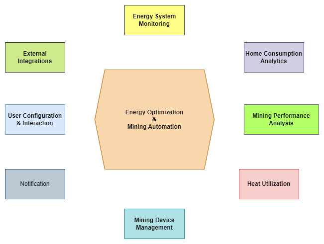

## Understand the Goal
The core purpose of the application is to help users manage excess energy production (especially from renewables) by using it for Bitcoin mining. The system should automate this process, make it user-friendly, and potentially leverage the heat generated by the miners.

## Identify the Core Domain
**What is the absolute central problem this application solves?**

It's the *optimization of energy usage* by integrating Bitcoin mining. This isn't just about mining; it's about using mining as *a tool* for energy management. The core domain revolves around the intelligent automation and control of mining based on energy availability and goals.

## Break Down the Problem into Subdomains
**Based on the description, what distinct areas of concern can be identified?**

- **Energy Production Monitoring**: Need to know how much energy is being produced (solar, wind, etc.).
- **Energy Storage Monitoring**: Need to know the state of charge of batteries.
- **Energy Consumption Monitoring**: Need to know how much energy the rest of the system (house, facility) is using.
- **Bitcoin Mining Control**: Need to turn miners on/off, maybe adjust power (though the text mainly mentions on/off).
- **Mining Performance/Profitability**: Users will care about how much Bitcoin they are earning.
- **Automation/Decision Logic**: The rules for *when* to mine based on energy data and forecasts.
- **Heat Management**: Using the byproduct heat.
- **User Interface/Configuration**: How users interact with the system.
- **External Data Integration**: Solar forecasts, maybe grid prices (though not explicitly mentioned for *control*).
- **Device Management**: Managing the physical miners (ASICs) and potentially other connected devices (smart plugs, sensors).
- **Home Energy Loads Forecasting**: Provide forcasts for domestic energy loads.

## Categorize Subdomains

- 🟢​ **Core:** The *automation/decision logic* is central. This is where the unique value proposition lies – making smart decisions about *when* to mine based on energy conditions. Let's call this Energy Optimization & Mining Automation.
- 🟣 **Supporting:** These domains are necessary for the core domain to function but aren't the primary differentiator.
    - **Energy System Monitoring**: Needs to provide data (production, storage, consumption) to the core domain. It doesn't *decide* anything, just reports.
    - **Mining Device Management**: Needs to execute the commands from the core domain (turn on/off) and maybe report miner status. It doesn't *decide* when to turn on/off.
    - **Heat Management**: Mentioned as a benefit, but the *automation* focus is on energy surplus, not primarily heat demand (though it could be a factor later). Let's keep it as supporting for now.
    - **Mining Performance Tracking**: Important for the user, but the core *automation* doesn't strictly depend on real-time profitability calculations (though it could influence user *goals*). Let's make it supporting.
    - **Home Energy Monitoring**: Needs to provide data (estimate consumptions, times) of the home energy loads (Washing machine, Dishwasher, Boiler, EV Charger) to the core domain. It can be a **core subdomain** (thanks to [this post](https://vladikk.com/2018/01/26/revisiting-the-basics-of-ddd/)), but let's keep it as supporting for now. 
- ⚫ **Generic:** These are common problems solved elsewhere, not specific to this domain.
    - **User Configuration**: Standard user accounts, settings, etc.
    - **External Data Integration** (e.g., Weather/Solar Forecast): Getting data from external services.
    - **Notification System**: Informing users about events.

## Refine Subdomain Names and Boundaries

- 🟢​ **Energy Optimization & Mining Automation** (Core): Seems good. Captures the intelligence.
- 🟣 **Energy System Monitoring** (Supporting): Good. Focuses on data acquisition from the energy plant (production, storage, consumption).
- 🟣 **Mining Device Management** (Supporting): Good. Focuses on controlling and possibly monitoring the state of the ASIC miners.
- 🟣 **Heat Utilization** (Supporting): Refined name. Could become more core if heat *demand* starts driving mining decisions, but based on the actual needs, it's primarily about *using* the byproduct.
- 🟣 **Mining Performance Analysis** (Supporting): Better name. Focuses on reporting earnings, hash rates, etc.
- 🟣 **Home Consumption Analytics** (Supporting): Better name. Focuses on home energy loads forcasts.
- 🟣⚫ **User Configuration & Interaction** (Supporting/Generic): Handles user settings, goals, and UI presentation. Let's treat it as Supporting as it presents data from other domains and takes user input that influences the Core domain.
- 🟣⚫ **External Integrations** (Supporting/Generic): For forecasts, potentially grid data, pool connections.

